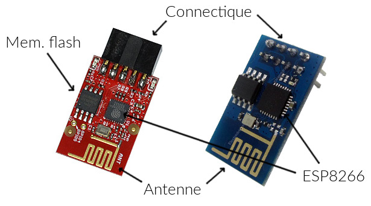
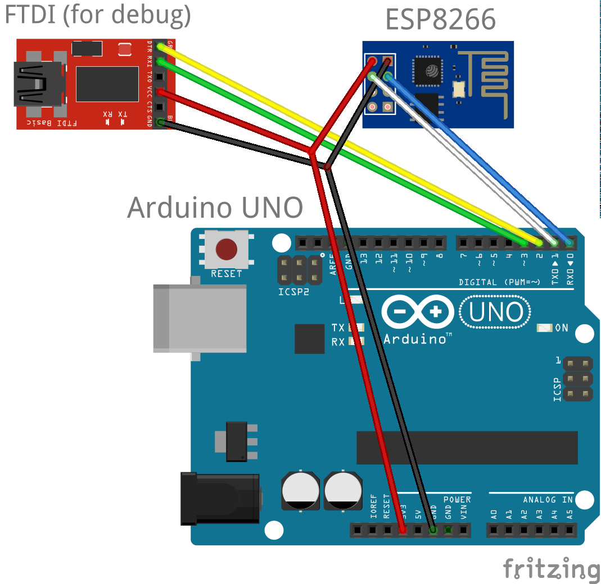

ESP8266
========

Experimentation / implementation of an hardware abstraction layer for the [ESP8266 (Olimex version)](https://www.olimex.com/Products/IoT/MOD-WIFI-ESP8266/open-source-hardware).

0. [Introduction](#Introduction)
1. [General description of the module](#Description)
2. [The firmware](#Firmware)
3. [Interfacing with Arduino Uno](#InterfacingWithUno)
4. [Commands format](#CommandsFormat)
5. [Concrete example](#Example)
6. [Hardware abstraction layer](#HAL)
7. [Ressources, references](#References)

<a name="Introduction"></a>
Introduction
============

The ESP8266 offers a great oppportunity of connecting electronics project to the Internet
because of its relative simplicity of use and cheap cost (around 5 euros or dollars). However
as it is quite a new technology, and despite the enthusiasm of the community, it still lacks
documentation, simple examples as well as robust implementations to easily interface it with 
the Arduino Uno.

This document lists several points that a developper willing to use the ESP8266 in a project 
should be aware of. Additionnaly the related github project aims to provide a user-friendly
library for the ESP8266 for it to be as easy to use as possible in the context of Arduino
Uno based projects and sending POST/GET requests.

<a name="Description"></a>
General description of the module
=================================

The module is made of these elements :
- the actual ESP8266 chip which is the core of the module
- the antenna that receive and emits signal
- a flash memory
- the pinout to interface the module with the rest of your project.



The module is a TTL serial device, meaning it it communicates using the same protocol used 
to program your Uno, writing datas on some RX and TX pins. Note that the pinout of the Olimex 
version of the module is quite different from the more official module. In particular, the 
GPIO pins need to be set to a particular state when trying to upgrade the firmware of the
module, and they are not easiliy accessible on the Olimex version (you will need a soldering 
iron).

Another important remark is that the ESP8266 operates at 3.3V. This is not a problem regarding
the powering as the Uno provides directly a 3.3V, but it might be a problem for the Serial
communication as the Uno will send data using 5V voltage whereas the ESP8266 expects 3.3V,
and vice-versa. To be entirely clean, one would need a voltage converter but it turns out
that a direct connexion also works (at least if you are not afraid of loosing your ESP8266).

Finally, there are comments on the Internets suggesting that the module might require
more than 200mA to operate (up to 1A ?). So far I was able to operate the module without
any need of an additional power stage, but that might also explain some of the instabilities
encountered.

<a name="Firmware"></a>
The firmware
============

The initial firmware you'll have on your ESP8266 is likely to be bugged, missing features,
outdated or just inappropriate for what you want to do. The firmware of the module can be 
upgraded provided that the GPIO and other pins are mapped appropriately and you've 
downloaded the appropriate tools. I found it useful to upgrade to
[the latest version (0.952) of AI-thinker](http://www.electrodragon.com/w/ESP8266_AT-command_firmware),
using [esptool](https://github.com/themadinventor/esptool). In particular, in can be useful 
to change the baudrate of the ESP to 9600 if you plan to use the SoftwareSerial of Arduino.
I found that it also solved an inability of the previous firmware versions to connect to
my freebox internet.

Alternatively, you may consider using NodeMCU (see [here](https://github.com/nodemcu/nodemcu-firmware/wiki/nodemcu_api_en) and [here](https://github.com/nodemcu/nodemcu-firmware/releases)) which lets you interact with the ESP with
LUA commands instead of the AT+commands.

<a name="InterfacingWithUno"></a>
Interfacing with Arduino Uno
============================

As mentionned, the module uses TTL serial communication. TTL serial capabilities are provided
natively by the Uno on the pin 0 and 1. However, as this is also a mean for debugging your
project by writing messages and monitoring them on the Serial Monitor, you probably want
to have two Serials at the same time. This is possible using the SerialSoftware library
which can emulate TTL serial communication on other pins of your Uno. Howevern if you want 
to have a baudrate higher than 9600 for the ESP, you won't be able to use the SerialSoftware.
You will instead need to use the HardwareSerial (pin 0 and 1) and debug through the SerialSoftware :
- pins 0 and 1, i.e. native Uno serial, are used for communicating with the ESP
- pins 2 and 3 are used via a software serial and interfaced with your laptop via a FTDI chip (USB <-> TTL)



Note that this configuration means that you will need to unplug your ESP each 
time you want to reprogram your Arduino as it also happens using the pins 0 and 1.

However if you changed the baudrate to 9600 or lower with whichever new firmware, then you can
simply use pin 2 and 3 to connect the ESP, and debug through the usual pin 0 and 1 (i.e.,
no FTDI needed).

<a name="CommandsFormat"></a>
Commands format
===============

Commands to the ESP8266 are sent using a format similar to other devices using TTL 
communication, such as GSMs. The format is `AT+[command name]` or `AT+[command name]=[arguments]`
if the command requires arguments. For instance, `AT+RST` will supposedly reset the module, 
then it will send a bunch of information and finish with `ready`. At any moment, you may 
send simply `AT` to check the status of your device and it should answer something like 
`OK` or `busy` depending on its status.

[Link to full list of commands goes here]

<a name="Example"></a>
Concrete example
================

```
// Create a software serial on pins 2 and 3 for debugging purpose

SoftwareSerial dbgSerial(2,3);

// Starts the serial communications with appropriate baud rate

dbgSerial.begin(9600); // This is for debugging
Serial.begin(115200);  // This is for the ESP

// Send reset command to the ESP

String command = "AT+RST";
dbgSerial.println("---- Sending :");
dbgSerial.println(command);

Serial.print(command);
Serial.print("\r\n");

// Read ESP answer during timeout = 2s

int timeout = 2000; 
String response = "";
long deadline = millis() + timeout;
while (millis() < deadline)
if (Serial.available())
{
    response += (char) Serial.read();
}

// Print answer on debugging

dbgSerial.println("---- Receiving :");
dbgSerial.println(response);

// Use a search/find function on the response string to find a "ready" substring.
bool ack = find(response,"ready");

// If "ready" has not been found, stop the Uno by looping to infinity
if (!ack) while (1) { }
```

<a name="HAL"></a>
Hardware abstraction layer
==========================

Todo

<a name="References"></a>
Ressources, references
======================

Todo

